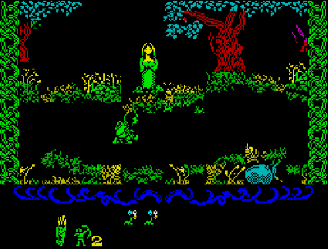
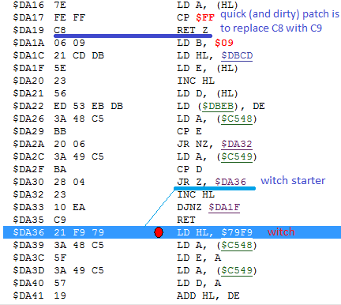

# A "no witch" patch for "Robin of the Wood" ZX-Spectrum game
This patch removes the witch from the ZX-Spectrum game "Robin of the Wood"

## This witch is now gone!



## Background
I was completely blown away by this game when I was 10 but I had a problem with this witch who was robbing me of every penny.\
Many years later I finally managed to do it!


## The patch
As it turned out the witch lives here:\
\


A quick fix is to replace C8 (RET Z) with C9 (RET)\
Just open your game snap/tap image in a HEX editor, search for these bytes:
```
7E FE FF C8 06 09
(there should be only 1 match found)
```
replace C8 with C9 and save the edited file, or use the provided 48K/128K versions already patched.
